Table of contents
=================
* This repository was initially started from the [Puppet-RampUpProgram](https://github.com/Puppet-RampUpProgram/control-repo) initial control repo.  We've added modules to do an automated SAP HANA & App Server installation.  These modules are in the **site** directory. Of course these modules may be used by themselves, or as this document describes as part of a brand-new Puppet Enterprise installation. 


* [Before starting](#before-starting)
* [What you get from this control\-repo](#what-you-get-from-this-control-repo)
* [High Level process summary for SAP](#high-level-process)
* [How to set it all up](#how-to-set-it-all-up)
  * [Copy this repo into your own Git server](#copy-this-repo-into-your-own-git-server)
    * [GitLab](#gitlab)
    * [Stash](#stash)
    * [GitHub](#github)
  * [Configure PE to use the control\-repo](#configure-pe-to-use-the-control-repo)
    * [Install PE](#install-pe)
    * [Get the control\-repo deployed on your master](#get-the-control-repo-deployed-on-your-master)
  * [Setup a webhook in your Git server](#setup-a-webhook-in-your-git-server)
    * [Gitlab](#gitlab-1)
  * [Test Code Manager](#test-code-manager)
  * [SAP Hana modules](#sap-hana-modules)

# Before starting

This control-repo and the steps below are intended to be used with a new installation of Puppet Enterprise (PE).

**Warning:** When using an existing PE installation any existing code or modules in `/etc/puppetlabs/code` will be copied to a backup directory `/etc/puppetlabs/code_bak_<timestamp>` in order to allow deploying code from Code Manager.

# What you get from this control-repo

When you finish the instructions below, you will have the beginning of a best practices installation of PE including:

 - A Git server (eg. GitHub)
 - The ability to push code to your Git server and have it automatically deployed to your PE master
 - A config_version script that outputs the most recent SHA of your code each time you run `puppet agent -t`
 - Optimal tuning of PE settings for this configuration
 - Working and example [roles and profiles](https://docs.puppet.com/pe/latest/puppet_assign_configurations.html#assigning-configuration-data-with-role-and-profile-modules) code
 - The ability to set up and install SAP Hana on RedHat Linux virtual machines in Azure

# High level process

1. Create an Azure Resource Group

1. Within the Azure Resource Group, create a virtual network.  This will handle traffic between the machines in Azure.  

1. Create an Azure Windows Virtual machine as a "client" machine within the resource group, on the virtual network created above.  These instructions describe setting up SAP in Azure within a locked-down environment - the SAP machines will not be accessible from the Internet.  This client machine will be able to access resources within the virtual network, including the SAP HANA server and the application servers.

1. Create an Azure virtual machine as the puppet server.  For this example we used an Ubuntu machine, but any machine that will run Puppet enterprise will be fine.

1. Install Puppet enterprise and the control_repo onto the puppet server.  This also includes customizing the Puppet modules as appropriate for your environment.

1. Configure Puppet Enterprise to be able to manage RedHat machines

1. Configure and run the SAP-Hana-Deploy resource group template

1. Configure the SAP modules within the PE server.  Run puppet on the SAP Hana machine and the App server machine

1. Verify SAP HANA installation

1. Run application server/ERP installation on the Application server

1. Verify correct operation of the environment

## Create an Azure Resource Group
  Log into the Azure portal at http://portal,azure.com.  You should get a window that looks like this:
  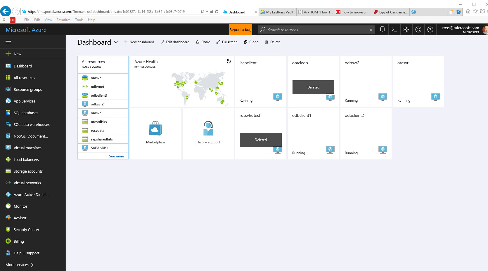. 
  Click the "+ New" button in the upper left:
  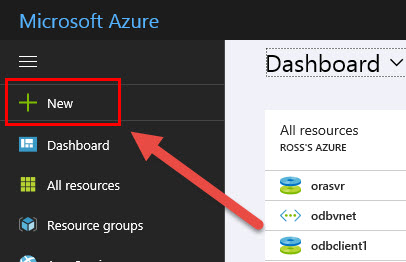
  In the search box that pops up, type "resource group" and hit return.  
  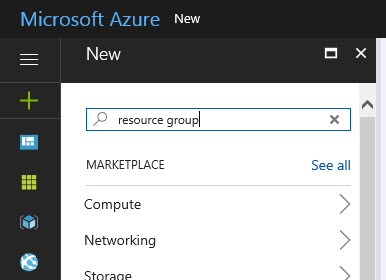
  Select the first choice in the results pane for "Resource group", and click the "create button".  
  Type a name for your resource group, and choose a location for the resource group, and click "create":
  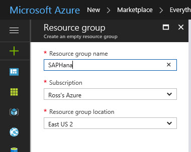

## Create an Azure Virtual Network

In the Azure portal, click "Resource Groups" 

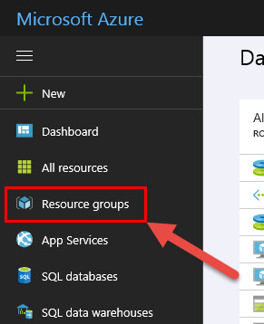

In the blade that comes up, click on the resource group you created above.  This will bring up the resource group blade:

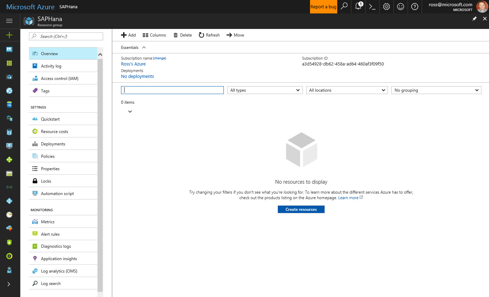

Click the "+ Add button":

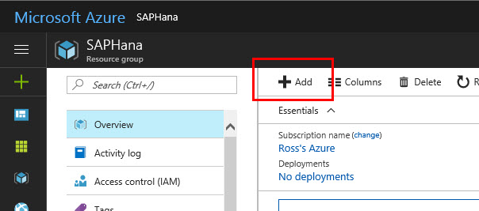

Choose "virtual network" in the "everything" blade that comes up, and choose create.

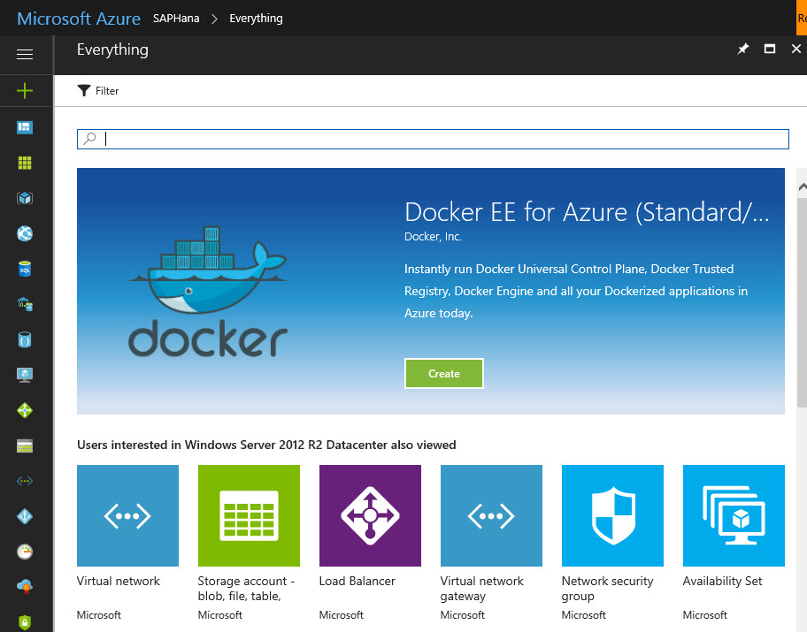

In the "Create virtual network blade, type a name for your virtual network, and verify the resource group and location are as you've planned, and click the create button:

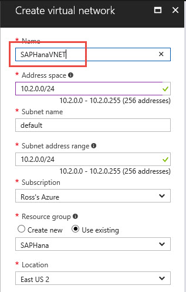

This will create the virtual network that your virtual machines will connect to.

## Create an Azure client Virtual machine

We will need a Windows Server client machine to access the other machines in our network.  To do this via the portal, go back to the resource group blade, and click "+ Add".  In the search box, type "windows server", and in the list that comes up, choose "Windows Server 2012 R2 Datacener":

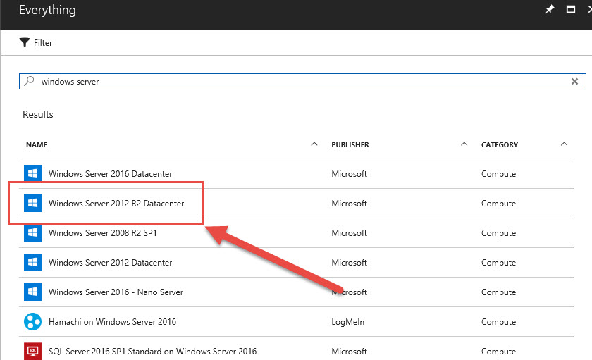

In the pane that comes up, select "create".  This will take you to the "Create Virtual Machine" blade.  Here, you will configure all the options for your new virtual machine.  

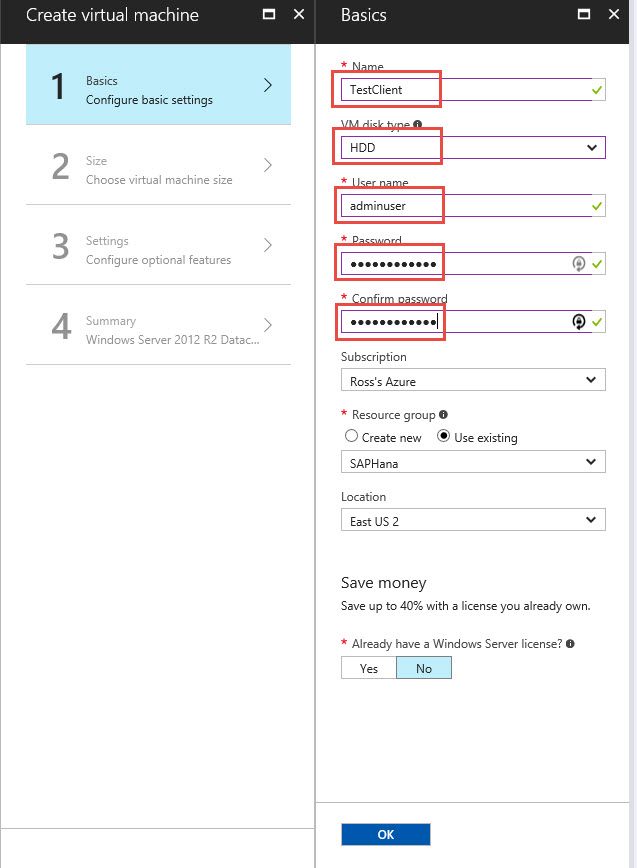

Type the name of your virtual machine, choose HDD for disk type, type a username and password, and choose OK. In the virtual machine size, you can choose the size you'd like.  We recommend the DS1_V2.  Finish the size selection by clicking "select".  In the Settings box that comes up, verify that the Virtual network name is the one you created earlier, and click "OK":

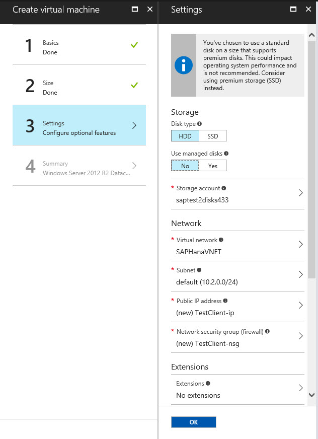

The Azure portal will then display and validate your options:

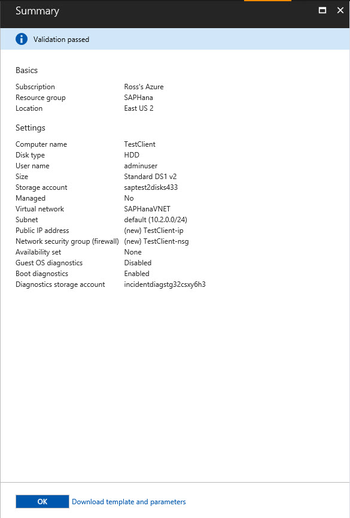

Click "OK", and the portal will create your virtual machine. This will typically take 3-5 minutes to complete, but you can continue on, since we won't need the virtual machine until we configure our Puppet Enterprise server.

## Fork the control_repo

In these instructions, we are going to assume the use of GitHub for the puppet repository.  For any other git source management, please refer to the documentation on your system.

1. Create a user in GitHub.  If you already have a user, go to http://www.github.com and log in with your username and password.

2. On the main page, click on the "New repository" button to create a repository for these artifacts: 

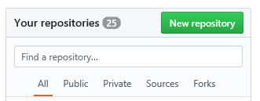

In the page that comes up, type a name for the repository (we used "control_repo"), and click "create repository".

3. On your laptop, clone our source control repo.
 - `git clone https://github.com/AzureCAT-GSI/control-repo.git`
 - `cd control-repo`

4. On your laptop, remove the origin remote.
 - `git remote remove origin`

5. On your laptop, add your GitLab repo as the origin remote.
 - `git remote add origin <SSH URL of your GitLab repo>`

6. On your laptop, push the production branch of the repo from your machine up to your Git server.
 - `git push origin production`

 At this point, all of the artifacts from our source repository are replicated into your own repository.  You can make changes to the configurations or code on your local machine, `git commit` and `git push origin production` to update the repository.

## Create a Puppet server in the virtual network

Go to the Azure portal, and open your resource group.  It should now show your virtual network and the virtual machine you created:

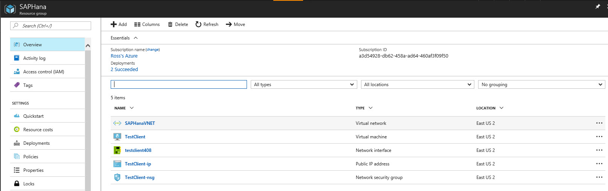

Click the "+ Add" button, and search for "Ubuntu Server 16.04 LTS", and select that in the results list.

** You can run Puppet Enterprise on various other Linux systems, but we chose Ubuntu server for ease of use.

The "Create virtual machine" blade is very similar to the one we had when we created the Windows Server virtual machine:

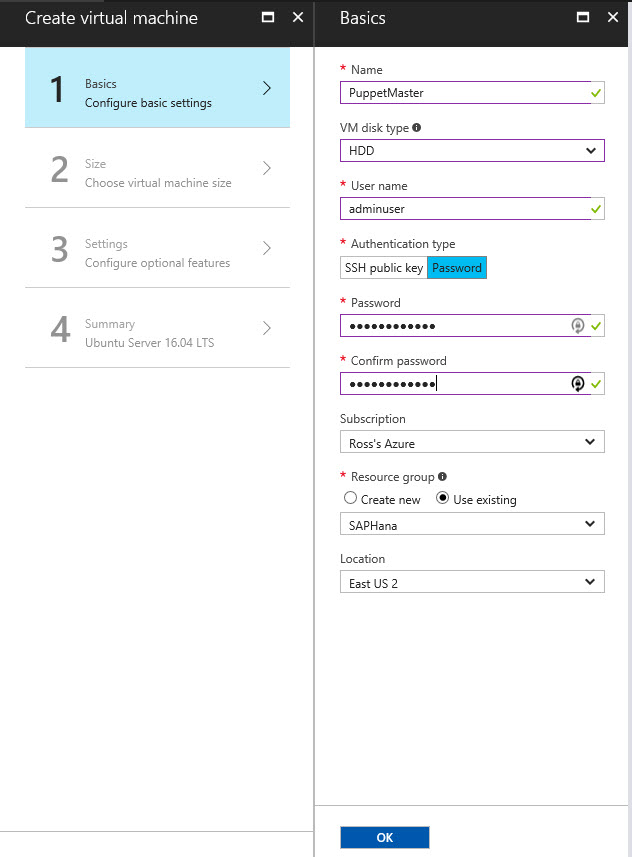

Here, choose a name for your PuppetMaster server, choose the VM disk type (HDD is fine), choose a username and select password authentication for the VM, and type & confirm a password.  Choose ok to continue.

In the virtual machine size blade, the D2_V2 Standard vm size is fine.

In the settings blade, click "Public IP address" and choose "None":

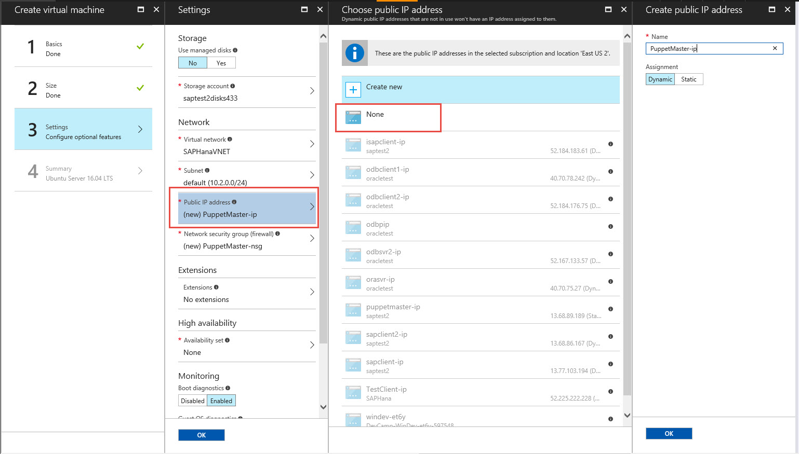

Also click "Network Security Group" and choose "none"

** These last two configurations change our Puppet Master server to be accessible from the virtual network only.  To get to it, we'lll have to install Putty or some other SSH software for windows.

Finally, click "OK" and create the virtual machine.

## Install Puppet Enterprise and your control_repo

In the Azure portal, open your resource group and click on the client machine you created earlier:

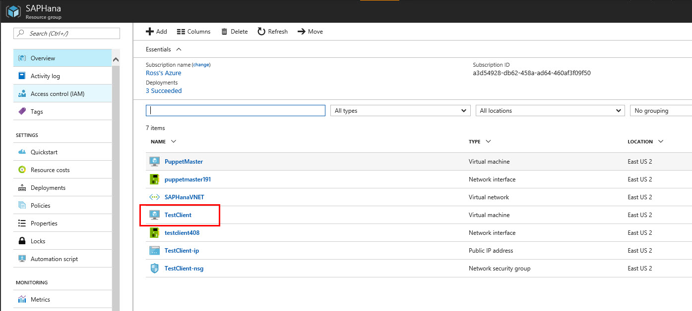

In the virtual machine blade that comes up, click "Connect":

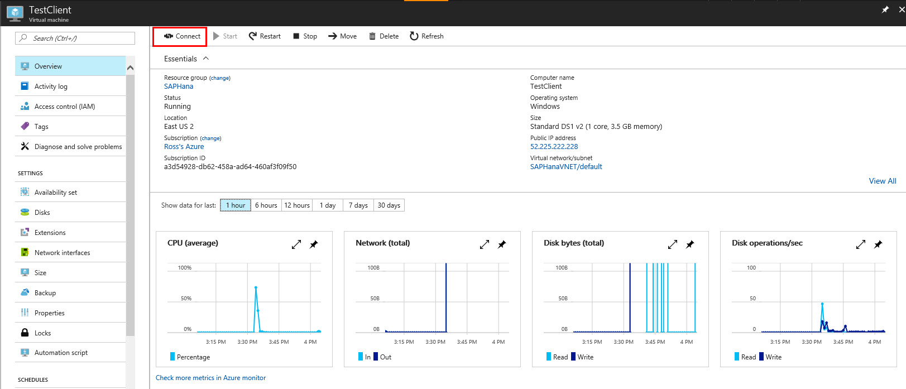

This will download an .RDP file to your machine.  Click on "Open" to open it:


Enter the credentials you used when you created the virtual machine.  This will start remote desktop to your client virtual machine, and you should have the "Server Manager" open:

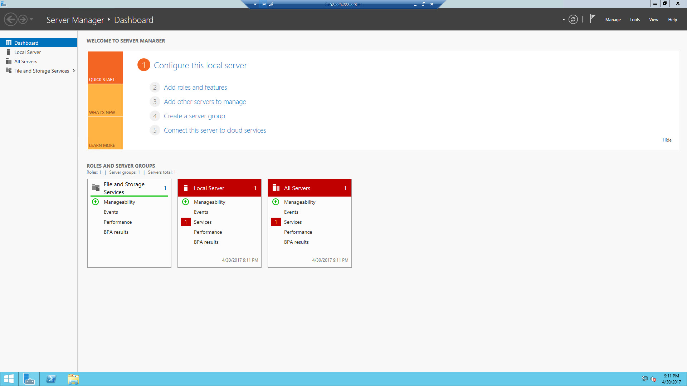

Click on "Local Server" and click on "IE Enhanced Security Configuration".  Turn IE Enhanced Security Configuration" off for administrators
> this is not a best practice for production servers - we are only setting this for ease of use for this documentation.

Download and install the 64-bit version of Putty from `http://www.chiark.greenend.org.uk/~sgtatham/putty/latest.html`

## Make note of Azure configurations

Before continuing, go to the Azure portal and make note of the subscription name, the subscription ID, the resource group name, the subnet name, and the internal IP address for both the test client machine and the PuppetMaster virtual machine.

## Configure PE to use the control-repo

### Install PE
1. On the test client machine, download the latest version of the PE installer for your platform
 - https://puppetlabs.com/download-puppet-enterprise
2. PSCP the downloaded installer to your Puppet master with a command like this:
```CMD
pscp puppet-enterprise-2017.1.0-ubuntu-16.04-amd64.tar.gz adminuser@10.2.0.5:/home/adminuser/puppet-enterprise-2017.1.0-ubuntu-16.04-amd64.tar.gz
```
3. SSH to the Puppet Master machine as the user you created (adminuser, in our case)
2. Expand the tarball (`tar -xzf puppet-enterprise-2017.1.0-ubuntu-16.04-amd64.tar.gz` and `cd` into the directory `puppet-enterprise-2017.1.0-ubuntu-16.04-amd64`
3. Run `sudo ./puppet-enterprise-installer` to install.  We used the "Text-mode" install, and in the configuration step (where the installer puts you into the vi editor with a configuration file), we only changed the admin user's password.

If you run into any issues or have more questions about the installer you can see the Puppet enterprise docs here:

http://docs.puppetlabs.com/pe/latest/install_basic.html

Be sure to run `puppet agent -t` which completes the puppet enterprise installation.

### Get the control-repo deployed on your master

At this point you have our control-repo code deployed into your Git server.  However, we have one final challenge: getting that code onto your Puppet master.  In the end state the master will pull code from the Git server via Code Manager, however, at this moment your Puppet master does not have credentials to get code from the Git server.

We will set up a deploy key in the Git server that will allow an SSH key we make to deploy the code and configure everything else.

1. On your Puppet master, make an SSH key for r10k to connect to GitHub

  ~~~bash
  sudo su -
  mkdir /etc/puppetlabs/puppetserver/ssh
  /usr/bin/ssh-keygen -t rsa -b 2048 -C 'code_manager' -f /etc/puppetlabs/puppetserver/ssh/id-control_repo.rsa -q -N ''
  cat /etc/puppetlabs/puppetserver/ssh/id-control_repo.rsa.pub
  ~~~

 - References:
    - https://help.github.com/articles/generating-ssh-keys/
    - http://doc.gitlab.com/ce/ssh/README.html

2. In the GitHub UI, create a deploy key on the `control-repo` project
 - Paste in the public key from above
3. Login to the PE console via a browser at https://<your puppetmaster ip address>
  you should get a screen that looks like this:
  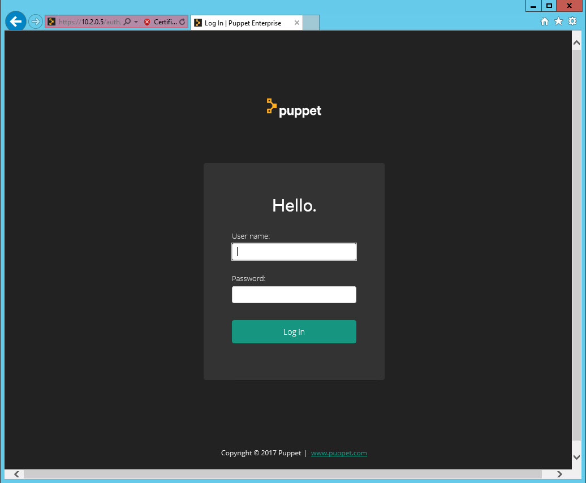
  
  The username is admin, and the password is whatever you set it to in the puppetmaster install above.
4. Navigate to the **Nodes > Classification** page
 - Click on the **PE Master** group
 - Click the **Classes** tab
 - Add the `puppet_enterprise::profile::master`
    - Set the `r10k_remote` to the SSH URL from the front page of your GitHub repo
    - Set the `r10k_private_key` parameter to `/etc/puppetlabs/puppetserver/ssh/id-control_repo.rsa`
 - **Commit** your changes
5. On your Puppet master
 - Run:

    ~~~
    puppet agent -t
    r10k deploy environment -pv
    puppet agent -t
    ~~~

5. Navigate back to the **Nodes > Classification** page
 - Near the top of the page select "add a group"
 - Type `role::all_in_one_pe` for the group name
    - Click the **Add Group** button
 - Click the **add membership rules, classes and variables** link that appears
    - Below **Pin specific nodes to the group** type your master's FQDN into the box
       - Click **pin node**
 - Select the **Classes** tab
    - On the right hand side, click the **Refresh** link
       - Wait for this to complete
    - In the **add new classes** box type `role::all_in_one_pe`
       - Click **add class**
 - **Commit** your changes
8. On your Puppet master
 - Run:

    ~~~
    puppet agent -t
    echo 'code_manager_mv_old_code=true' > /opt/puppetlabs/facter/facts.d/code_manager_mv_old_code.txt
    puppet agent -t
    ~~~

9. Code Manager is configured and has been used to deploy your code


## Configure puppet to manage RedHat machines
  In the puppet console navigate back to the **Nodes > Classification** page, and in the **PE Infrastructure** group, select the **PE Master** node.  

  On the Classes tab in the Class name field, enter pe_repo and select `pe_repo::platform::el_7_x86_64` from the list of classes.

  Click **Add class**, and commit changes.

  Run `puppet agent -t` on the Puppet Master to configure the Puppet master node.

## Configure and run the SAP-Hana-Deploy resource group template

Download the SAP-Hana-Deploy resource group template onto your local machine with `git clone https://github.com/AzureCAT-GSI/SAP-Hana-Deploy.git`.  

### Deployment Instructions
  1. Open **.\deploymentParameters\appsTier.Parameters.json**
  2. Replace the values in the following properties to match your environment:
      * `virtualNetworkResourceGroupName` : The name of the __resource group__ that contains the virtual network you want the SAP ERP virtual machine deployed in.
      * `virtualNetworkName` : The name of the virtual network.
      * `subnetName` : The name of the subnet where you want the SAP ERP virtual machine deployed.
      * `privateIpAddresses` :The private IP addresses to assign to the network interface cards (NICS) attached to the SAP ERP virtual machine.  You must specify two private IP addresses from the subnet address range.
      * `puppetServerIpAddress` : The private IP address of the Puppet Server virtual machine.
  4. (optional) You can change other properties, such as vmName, vmSize, image, etc. to customize the deployment to your environment.  
  5. Save the changes.
  6. Open **.\deploymentParameters\dataTier.Parameters.json**
  7. Repeat steps 2 through 4 for the SAP Hana DB virtual machine.
  8. Open a PowerShell console.
  ```PowerShell
  ## Authenticate to Azure Subscription
  Login-AzureRmAccount

  ## Deploy 
  .\Deploy-AzureResourceGroup.ps1 -ResourceGroupLocation westus
  ```
>> The default resource group name is "SAP-Hana-IaaC"; if you would like something different, use the parameter -ResourceGroupName <your resource group name here>

## Configure the SAP modules within the PE server
After the machines have been created using the resource group template above, they will automatically attampt to register themselves with the PuppetMaster server.  Go to the Puppet Enterprise admin console.
Under **Nodes/Unsigned Certificates** you should see two requests for certificates, one from each of the machines that the resource group template created:

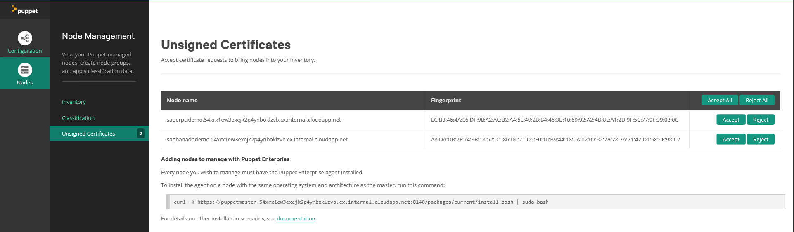  

Accept both.  The actual process for registration will take a few minutes before the new machines show up in the inventory page.

In the puppet enterprise console, click on Nodes, and Classification, and create a new group named "RHEL_Nodes".  Click on "Add Membership rules, classes and variables", and Configure the rule to be "osfamily = RedHat".

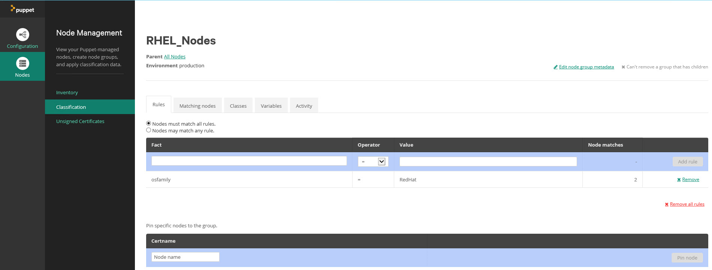

click on the "classes" tab, and the parameters rh_user and rh_password.  Put in values for these that are appropriate for your subscription for RedHat.  This is necessary to receive updates to your Linux VMs.

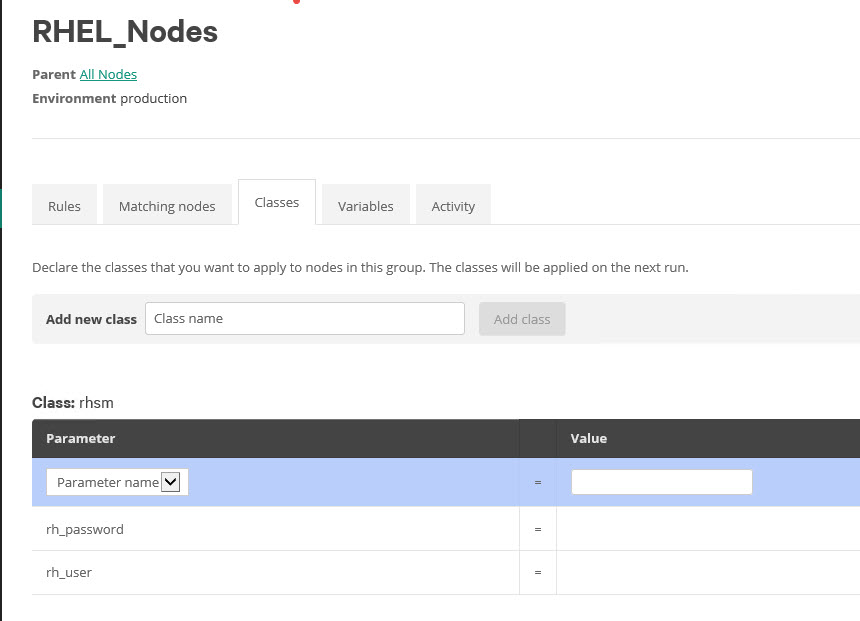

Under the RHEL_Nodes, create another group of machines called `SAPHANA_Nodes`, and make the maching rule be hostname=saphanadb:

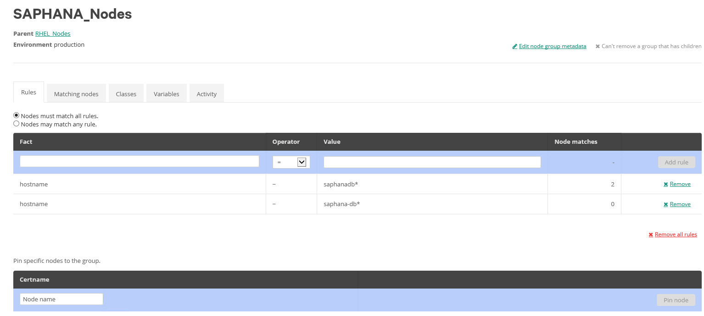

Click the `Classes` tab, and add the class **role:saphana**.  Save all changes.

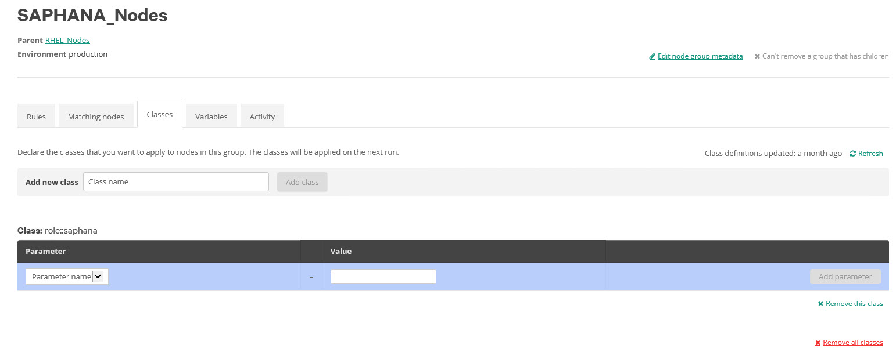

Next create a rule for the SAP Application server.  Under the RHEL_Nodes, create a group of machines called `SAPAPP_Nodes`, with the rule that `hostname=saperpci*`. 

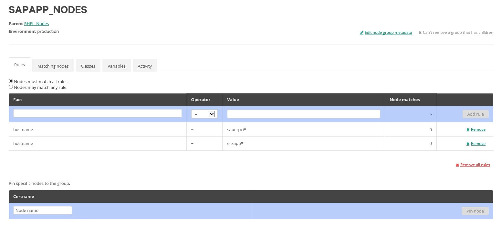

Click the `classes` tab, and add`role=sapapp`:

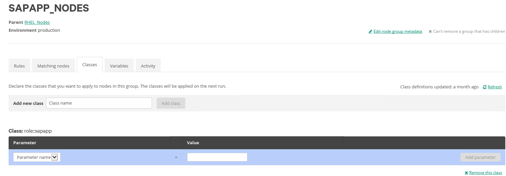

save all configurations.


## Verify SAP HANA installation
After approximately 25 minutes, the SAP Hana machine should be fully configured and installed.  To check the installation, you can SSH to the Hana machine (sapHanaDB) and do the following commands:
```bash
  sudo su -
  su hdbadm
  HDB info
```
This should give information on the running HANA server, similar to this:
<put snippet from actual test here>
## Run application Server/ERP installation
<put instructions here>
## Verify correct operation of the environment
<discuss potential installation of sapgui on the client machine, and connecting to the app server.


##SAP HANA Modules
The Puppet modules that configure and install the software as described above are located in this control_repo.  They are specific to creating a test HANA & Application server environment in Azure, and depend on a resource group being created using the [SAP-HANA-DEPLOY](https://github.com/AzureCAT-GSI/SAP-Hana-Deploy) template, as described above.  Please refer to the template for documentation on usage.

These modules consist of:
1. hanaconfig - this module configures a vanilla RedHat 7.2 virtual machine with the proper configurations for SAP hana.  
1. hanapartition - this module configures 4 premium drives into a logical volume group, creates volumes within it, mounts the volumes appropriately for HANA, and adds the volumes to the /etc/fstab
1. sapmount - mounts the Azure Files repository, which contains the artifacts for installation
1. saphana - performs the automated install of SAP hana 
1. sapfastmount - downloads the sapmount files into a partition, for faster installation of the ERP package
1. sapapp - prepares the app server for execution of the application server & ERP install
